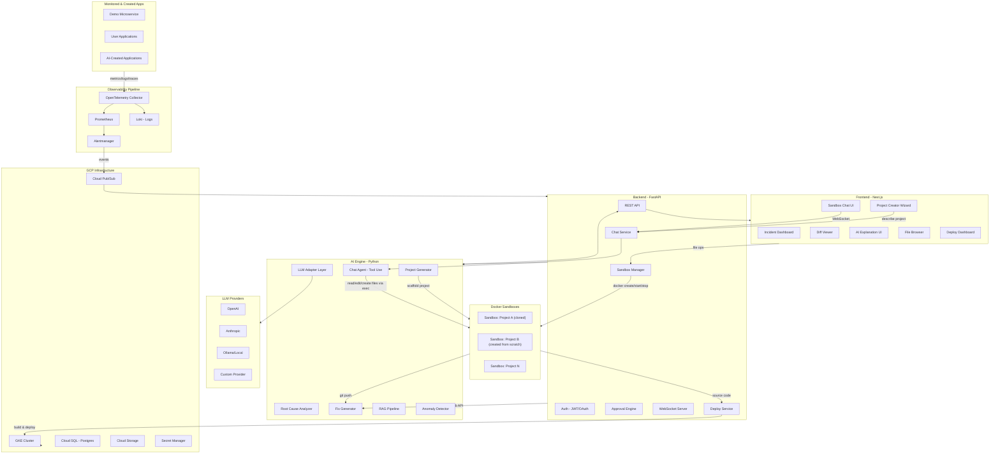
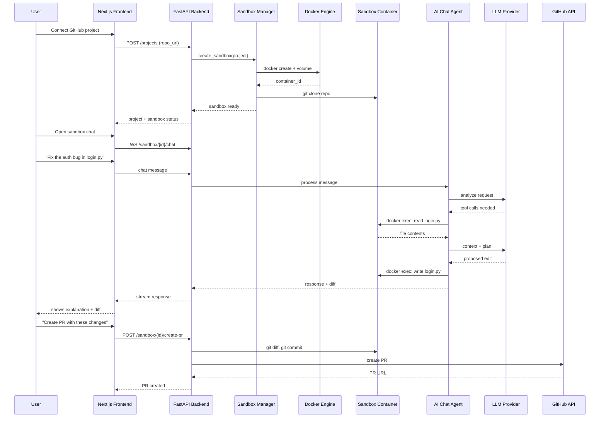
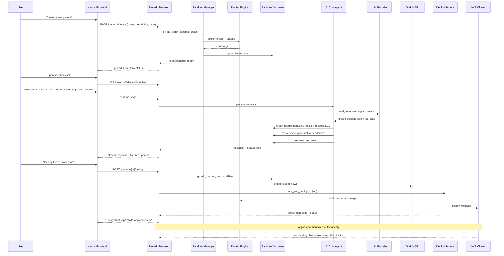

# Comio: 30-Day Build Plan

> An AI-powered autonomous development and DevOps platform that can **create projects from scratch**, edit and refactor existing codebases, **deploy applications**, and monitor deployed applications — all through a conversational AI chat interface. It detects failures via ML anomaly detection, diagnoses root causes with LLMs (via a provider-agnostic adapter), proposes fixes as PRs, provides per-project Docker sandboxes with an AI chat coding interface, and runs on GCP (GKE + Terraform). Comio covers the **full application lifecycle**: Create → Edit → Deploy → Monitor → Diagnose → Fix.

## Architecture Overview



### Sandbox Architecture Detail



### Project Creation Flow (NEW)



### Full Application Lifecycle

```
┌─────────┐     ┌─────────┐     ┌──────────┐     ┌─────────┐     ┌───────────┐     ┌─────────┐
│ CREATE  │────>│  EDIT   │────>│  DEPLOY  │────>│ MONITOR │────>│ DIAGNOSE  │────>│   FIX   │
│         │     │         │     │          │     │         │     │           │     │         │
│ AI      │     │ AI Chat │     │ One-click│     │ Anomaly │     │ LLM Root  │     │ Auto-PR │
│ builds  │     │ edits   │     │ deploy   │     │ Detect  │     │ Cause     │     │ with    │
│ project │     │ code in │     │ to GKE   │     │ + Alert │     │ Analysis  │     │ approval│
│ from    │     │ sandbox │     │          │     │         │     │           │     │         │
│ scratch │     │         │     │          │     │         │     │           │     │         │
└─────────┘     └─────────┘     └──────────┘     └─────────┘     └───────────┘     └─────────┘
      ↑                                                                                  │
      └──────────────────────────────────────────────────────────────────────────────────┘
                                    Continuous Lifecycle Loop
```

---

## Monorepo Structure

```
comio/
├── apps/
│   ├── web/                    # Next.js frontend
│   │   └── app/
│   │       ├── dashboard/
│   │       ├── incidents/
│   │       ├── projects/
│   │       │   └── [id]/
│   │       │       └── sandbox/    # Sandbox chat + file browser UI
│   │       └── settings/
│   ├── api/                    # FastAPI backend
│   │   ├── routes/
│   │   │   ├── projects.py
│   │   │   ├── incidents.py
│   │   │   ├── sandbox.py      # Sandbox CRUD + file ops endpoints
│   │   │   ├── chat.py         # Chat WebSocket + REST endpoints
│   │   │   └── deploy.py       # Deploy endpoints (build, deploy, status)
│   │   ├── services/
│   │   │   ├── sandbox_manager.py   # Docker container lifecycle
│   │   │   ├── chat_service.py      # Chat orchestration
│   │   │   ├── file_ops_service.py  # File read/write inside containers
│   │   │   └── deploy_service.py    # Build + deploy projects to GKE/cloud
│   │   └── models/
│   │       ├── sandbox.py      # Sandbox model
│   │       ├── chat.py         # ChatSession + ChatMessage models
│   │       └── deployment.py   # Deployment model (status, URL, logs)
│   └── demo-app/               # Demo microservice to monitor
├── packages/
│   ├── ai-engine/              # LLM adapter, RCA, fix generation
│   │   ├── adapters/           # LLM provider adapters
│   │   ├── rca/                # Root cause analysis
│   │   ├── fix_generator/      # Code fix generation
│   │   ├── rag/                # RAG pipeline
│   │   ├── chat_agent/         # Sandbox chat agent (tool-use loop)
│   │   │   ├── agent.py        # Main agent loop
│   │   │   └── tools.py        # read_file, edit_file, search, run_cmd, deploy
│   │   ├── project_generator/  # AI project scaffolding from natural language
│   │   │   ├── generator.py    # Project creation orchestrator
│   │   │   └── templates/      # Base templates for common project types
│   │   └── policy/             # Policy engine
│   ├── anomaly-detector/       # ML anomaly detection
│   ├── observability/          # OTel collector configs, dashboards
│   └── shared/                 # Shared types, utils, constants
├── infra/
│   ├── observability/          # Monitoring and alerting configs
│   │   ├── prometheus.yml      # Prometheus scrape config
│   │   ├── alert_rules.yml     # Alerting rules
│   │   └── alertmanager.yml    # Alert routing config
│   ├── terraform/              # GCP infrastructure
│   │   ├── modules/
│   │   ├── environments/
│   │   └── main.tf
│   ├── k8s/                    # Kubernetes manifests
│   │   ├── base/
│   │   └── overlays/
│   └── docker/
│       ├── Dockerfile.api
│       ├── Dockerfile.web
│       ├── Dockerfile.demo-app
│       └── Dockerfile.sandbox  # Base image for sandbox containers
├── scripts/                    # Dev scripts, seed data
├── docs/                       # Architecture docs, ADRs
├── .github/workflows/          # CI/CD
├── docker-compose.yml          # Local dev environment
├── pyproject.toml              # Python workspace config
└── README.md
```

---

## Week 1 (Days 1-7): Foundation, LLM Adapters, and Sandbox System

### Day 1: Project Scaffolding and Dev Environment

**Goal:** Monorepo skeleton, all dependency files, local Docker Compose, CI lint pipeline.

- Initialize monorepo structure (all directories listed above, including sandbox-related paths)
- `apps/api/`: FastAPI project with `pyproject.toml`, Poetry/uv
  - Dependencies: `fastapi`, `uvicorn`, `sqlalchemy`, `alembic`, `pydantic`, `python-jose`, `passlib`, `httpx`, `docker` (Python Docker SDK), `websockets`
- `apps/web/`: Next.js 14 app with TypeScript, Tailwind CSS, shadcn/ui
- `packages/ai-engine/`: Python package with `pyproject.toml`
- `docker-compose.yml` with: Postgres 16 (with pgvector), Redis, API (hot-reload), Web (hot-reload)
- `.github/workflows/ci.yml`: lint (ruff, eslint), type-check (mypy, tsc), test
- `README.md` with setup instructions
- `.env.example` with all required env vars (including `DOCKER_HOST`, `SANDBOX_NETWORK`, `GITHUB_TOKEN`)

### Day 2: Database Schema and Backend Core

**Goal:** Core data models including sandbox and chat models, migrations, CRUD API skeleton.

- Design and implement SQLAlchemy models in `apps/api/models/`:
  - `Project` — application (name, repo_url, github_token, config, **origin** ["cloned" | "created"], **project_type** ["api" | "web" | "fullstack" | "cli" | "library" | "other"], **description**)
  - `Incident` — detected issue (severity, status, timestamps, source)
  - `Diagnosis` — AI analysis result (root_cause, confidence, explanation)
  - `Remediation` — proposed fix (diff, type, status, pr_url)
  - `User` — platform user (email, role, oauth_id)
  - `AuditLog` — all actions for compliance
  - **`Sandbox`** — per-project container (container_id, status, project_id, created_at, last_synced_at, resource_limits, git_branch)
  - **`ChatSession`** — conversation thread (sandbox_id, user_id, title, created_at, is_active)
  - **`ChatMessage`** — individual messages (session_id, role [user|assistant|system|tool], content, tool_calls JSON, files_modified list, created_at)
  - **`Deployment`** — deployment record (project_id, status ["building" | "deploying" | "running" | "failed" | "stopped"], deploy_url, image_tag, environment, created_at, logs, resource_usage)
- Alembic migrations
- Pydantic request/response schemas in `apps/api/schemas/`
- Base CRUD operations with repository pattern in `apps/api/repositories/`

### Day 3: Auth and API Layer

**Goal:** JWT auth, role-based access, core REST endpoints including sandbox routes.

- JWT authentication middleware (`apps/api/auth/`)
  - Login/register endpoints
  - GitHub OAuth flow (needed for repo access)
  - Token refresh flow
  - Role enum: `viewer`, `operator`, `admin`
- API routes in `apps/api/routes/`:
  - `POST /projects` — register an existing project to monitor (triggers sandbox creation via git clone)
  - **`POST /projects/create`** — create a new project from scratch (triggers blank sandbox creation with git init)
  - `GET /incidents` — list incidents with filters
  - `GET /incidents/{id}` — incident detail with diagnosis
  - `POST /incidents/{id}/approve` — approve a remediation
  - `GET /diagnoses/{id}` — AI explanation
  - **`GET /projects/{id}/sandbox`** — sandbox status
  - **`POST /projects/{id}/sandbox/sync`** — git pull latest changes
  - **`GET /projects/{id}/sandbox/files`** — list files in sandbox
  - **`GET /projects/{id}/sandbox/files/{path}`** — read file content
  - **`WS /projects/{id}/sandbox/chat`** — WebSocket for chat
  - **`POST /projects/{id}/deploy`** — build and deploy the project
  - **`GET /projects/{id}/deployments`** — list deployment history
  - **`GET /projects/{id}/deployments/{did}`** — deployment detail (status, URL, logs)
  - **`POST /projects/{id}/deployments/{did}/stop`** — stop a running deployment
  - **`POST /projects/{id}/deployments/{did}/redeploy`** — redeploy with latest code
  - `GET /health` — health check
- Dependency injection for DB sessions, current user
- Error handling middleware, request ID tracking

### Day 4: LLM Adapter Layer (Core Scalability Piece)

**Goal:** Provider-agnostic LLM adapter with strategy pattern. This is the key scalability layer. Both the incident RCA system and the sandbox chat agent will use this.

- Design in `packages/ai-engine/adapters/`:

```python
# packages/ai-engine/adapters/base.py
from abc import ABC, abstractmethod
from dataclasses import dataclass
from typing import AsyncIterator

@dataclass
class LLMResponse:
    content: str
    model: str
    provider: str
    usage: dict          # tokens in/out/cost
    latency_ms: float
    tool_calls: list     # for function/tool calling
    raw_response: dict

class BaseLLMAdapter(ABC):
    @abstractmethod
    async def complete(self, messages, tools=None, **kwargs) -> LLMResponse: ...

    @abstractmethod
    async def complete_structured(self, messages, schema, **kwargs) -> LLMResponse: ...

    @abstractmethod
    async def stream(self, messages, tools=None, **kwargs) -> AsyncIterator[str]: ...

    @abstractmethod
    def supports_function_calling(self) -> bool: ...

    @abstractmethod
    def supports_streaming(self) -> bool: ...

    @abstractmethod
    def max_context_window(self) -> int: ...
```

- Implement concrete adapters:
  - `OpenAIAdapter` — GPT-4o, GPT-4-turbo (supports tool calling)
  - `AnthropicAdapter` — Claude 3.5 Sonnet, Claude 3 Opus (supports tool calling)
  - `OllamaAdapter` — local models (Llama, Mistral)
- `AdapterFactory` — instantiate by config string
- `AdapterRegistry` — register custom adapters at runtime
- Middleware chain (decorator pattern):
  - `RetryMiddleware` — exponential backoff on rate limits
  - `CostTrackingMiddleware` — log tokens + cost per call
  - `CachingMiddleware` — Redis-based response cache
  - `RateLimitMiddleware` — per-provider rate limiting
  - `TokenCountMiddleware` — pre-check context window limits
- Unit tests for each adapter with mocked API responses

### Day 5: Sandbox Manager — Container Lifecycle

**Goal:** Build the `SandboxManager` service that provisions and manages persistent Docker containers per project.

- `apps/api/services/sandbox_manager.py`:

```python
class SandboxManager:
    """Manages Docker container lifecycle for project sandboxes."""

    async def create_sandbox(self, project: Project) -> Sandbox:
        """Create a new sandbox: pull image, create container, clone repo."""

    async def create_blank_sandbox(self, project: Project) -> Sandbox:
        """Create an empty sandbox for new projects: pull image, create container,
        git init (no clone). Used when creating projects from scratch."""

    async def start_sandbox(self, sandbox_id: str) -> None:
        """Start a stopped sandbox container."""

    async def stop_sandbox(self, sandbox_id: str) -> None:
        """Stop a running sandbox (preserves state)."""

    async def destroy_sandbox(self, sandbox_id: str) -> None:
        """Remove container and cleanup volumes."""

    async def get_status(self, sandbox_id: str) -> SandboxStatus:
        """Get container status, resource usage, git state."""

    async def sync_repo(self, sandbox_id: str, branch: str = "main") -> None:
        """Git pull latest changes into the sandbox."""

    async def exec_command(self, sandbox_id: str, cmd: list[str],
                           timeout: int = 30) -> ExecResult:
        """Execute a command inside the sandbox container."""

    async def publish_to_github(self, sandbox_id: str, repo_name: str,
                                 private: bool = True) -> str:
        """Create a GitHub repo from sandbox code and push. Returns repo URL.
        Used when an AI-created project is ready to be published."""
```

- `Dockerfile.sandbox` — base image for all sandbox containers:
  - Based on `python:3.12-slim` (or a polyglot image with Node.js + Python + Go)
  - Pre-installed: `git`, `curl`, `ripgrep`, `jq`, common language runtimes
  - Non-root user `sandbox` with restricted permissions
  - Working directory `/workspace`
  - Health check script
- Docker networking:
  - Dedicated `comio-sandbox` Docker network
  - Sandboxes cannot reach the host or other sandboxes (network isolation)
  - Sandboxes CAN reach the internet (for `npm install`, `pip install`, etc.)
- Resource limits per container:
  - CPU: 1 core (configurable)
  - Memory: 512MB (configurable)
  - Disk: 2GB volume (configurable)
  - No privileged mode, no Docker socket mount
- Container lifecycle events -> stored in `Sandbox` model + `AuditLog`
- Volume management:
  - Named Docker volume per sandbox for persistence
  - Repo cloned into volume on first create
  - Volume survives container restarts

### Day 6: Sandbox File Operations API

**Goal:** Enable reading, writing, listing, and searching files inside sandbox containers.

- `apps/api/services/file_ops_service.py`:

```python
class FileOpsService:
    """File operations inside sandbox containers via docker exec."""

    async def list_files(self, sandbox_id: str, path: str = "/workspace",
                         recursive: bool = False) -> list[FileEntry]:
        """List files/dirs at path. Returns name, type, size, modified."""

    async def read_file(self, sandbox_id: str, path: str) -> FileContent:
        """Read file content. Returns content + metadata (lines, size, language)."""

    async def write_file(self, sandbox_id: str, path: str, content: str) -> None:
        """Write/overwrite file content. Validates path is within /workspace."""

    async def search_files(self, sandbox_id: str, query: str,
                           glob: str = None) -> list[SearchResult]:
        """Search file contents using ripgrep inside the container."""

    async def git_status(self, sandbox_id: str) -> GitStatus:
        """Run git status, return changed/staged/untracked files."""

    async def git_diff(self, sandbox_id: str, file: str = None) -> str:
        """Get git diff of changes made in the sandbox."""

    async def create_branch(self, sandbox_id: str, branch_name: str) -> None:
        """Create and checkout a new branch for the changes."""

    async def commit_and_push(self, sandbox_id: str, message: str) -> str:
        """Commit changes, push to remote, return commit SHA."""

    async def create_pr(self, sandbox_id: str, title: str, body: str,
                        base: str = "main") -> str:
        """Create a GitHub PR from the sandbox branch. Returns PR URL."""
```

- REST API endpoints in `apps/api/routes/sandbox.py`:
  - `GET /projects/{id}/sandbox/files?path=&recursive=` — list files
  - `GET /projects/{id}/sandbox/files/{path:path}` — read file
  - `PUT /projects/{id}/sandbox/files/{path:path}` — write file
  - `GET /projects/{id}/sandbox/search?q=&glob=` — search
  - `GET /projects/{id}/sandbox/git/status` — git status
  - `GET /projects/{id}/sandbox/git/diff` — git diff
  - `POST /projects/{id}/sandbox/git/commit` — commit + push
  - `POST /projects/{id}/sandbox/git/pr` — create PR
- Security:
  - Path traversal prevention (all paths must be under `/workspace`)
  - File size limits (max 1MB read/write)
  - Binary file detection (skip non-text files)
  - Rate limiting on write operations

### Day 7: Sandbox Chat Backend — AI Agent with Tool Use

**Goal:** Build the chat service where users converse with an AI that can read, edit, and search files inside their project sandbox. This is the core "Cursor-like" experience.

- `packages/ai-engine/chat_agent/tools.py` — tools the AI can invoke inside the sandbox:

```python
SANDBOX_TOOLS = [
    # --- File Operations ---
    {
        "name": "read_file",
        "description": "Read the contents of a file in the project",
        "parameters": {"path": "string"}
    },
    {
        "name": "edit_file",
        "description": "Edit a file by replacing old_string with new_string",
        "parameters": {"path": "string", "old_string": "string", "new_string": "string"}
    },
    {
        "name": "create_file",
        "description": "Create a new file with the given content",
        "parameters": {"path": "string", "content": "string"}
    },
    {
        "name": "delete_file",
        "description": "Delete a file from the project",
        "parameters": {"path": "string"}
    },
    {
        "name": "search_codebase",
        "description": "Search for a pattern across the codebase",
        "parameters": {"query": "string", "glob": "string (optional)"}
    },
    {
        "name": "list_directory",
        "description": "List files in a directory",
        "parameters": {"path": "string", "recursive": "boolean"}
    },
    # --- Execution ---
    {
        "name": "run_command",
        "description": "Run a shell command (e.g., install deps, run tests, lint, build)",
        "parameters": {"command": "string"}
    },
    # --- Project Scaffolding (for creating projects from scratch) ---
    {
        "name": "create_directory",
        "description": "Create a directory (and parent directories if needed)",
        "parameters": {"path": "string"}
    },
    {
        "name": "scaffold_project",
        "description": "Generate a project structure from a template (e.g., fastapi, nextjs, flask, express, react)",
        "parameters": {"template": "string", "name": "string", "options": "object (optional)"}
    },
    # --- Git & Deploy ---
    {
        "name": "git_commit",
        "description": "Stage all changes and create a git commit",
        "parameters": {"message": "string"}
    },
    {
        "name": "publish_to_github",
        "description": "Create a GitHub repo and push the project code",
        "parameters": {"repo_name": "string", "private": "boolean", "description": "string"}
    },
    {
        "name": "deploy",
        "description": "Build and deploy the project to production/staging",
        "parameters": {"environment": "string (production|staging)", "config": "object (optional)"}
    }
]
```

- `packages/ai-engine/chat_agent/agent.py` — the agentic loop:

```python
class SandboxChatAgent:
    """AI agent that can create, read, edit, deploy code inside a sandbox container.
    
    Supports the full lifecycle:
    - CREATE: Scaffold new projects from natural language descriptions
    - EDIT: Read, search, and modify existing code
    - BUILD: Install dependencies, run tests, lint
    - DEPLOY: Push to GitHub, build Docker images, deploy to cloud
    """

    def __init__(self, llm_adapter: BaseLLMAdapter,
                 file_ops: FileOpsService,
                 sandbox_manager: SandboxManager,
                 deploy_service: DeployService):
        self.llm = llm_adapter
        self.file_ops = file_ops
        self.sandbox_mgr = sandbox_manager
        self.deploy_svc = deploy_service

    async def process_message(self, sandbox_id: str,
                              session: ChatSession,
                              user_message: str) -> AsyncIterator[ChatEvent]:
        """
        Process a user message:
        1. Load conversation history from session
        2. Send to LLM with tool definitions (file ops + scaffold + deploy)
        3. If LLM wants to call tools -> execute in sandbox -> feed result back
        4. Loop until LLM produces a final text response
        5. Yield streaming ChatEvents (text chunks, tool calls, diffs)
        
        The agent auto-detects intent:
        - "Build me a REST API for..." -> scaffold + create files + install deps
        - "Fix the bug in..." -> read + diagnose + edit
        - "Deploy this" -> commit + push + build + deploy
        - "Add a new endpoint..." -> read context + edit files
        """
```

- `apps/api/services/chat_service.py`:
  - Manages `ChatSession` and `ChatMessage` persistence
  - Handles WebSocket connection for streaming responses
  - Routes messages to `SandboxChatAgent`
  - Tracks files modified per message (for showing diffs in UI)
  - Conversation context management: summarize old messages when context window fills
- WebSocket protocol (`WS /projects/{id}/sandbox/chat`):
  - Client sends: `{"type": "message", "content": "Fix the auth bug"}`
  - Server streams back:
    - `{"type": "thinking", "content": "Analyzing the auth module..."}` (optional)
    - `{"type": "tool_call", "tool": "read_file", "args": {"path": "auth/login.py"}}` (shows user what AI is doing)
    - `{"type": "tool_result", "tool": "read_file", "result": "...file contents..."}` (optional, can be hidden)
    - `{"type": "text", "content": "I found the bug. The token..."}`  (streamed token by token)
    - `{"type": "diff", "file": "auth/login.py", "old": "...", "new": "..."}` (shows the edit)
    - `{"type": "file_created", "file": "new_file.py", "content": "..."}` (when AI creates new files)
    - `{"type": "command_output", "command": "pip install ...", "output": "..."}` (install/build output)
    - `{"type": "deploy_status", "status": "building|deploying|live", "url": "..."}` (deployment progress)
    - `{"type": "done", "files_modified": ["auth/login.py"], "files_created": ["new_file.py"]}` (final event)
- Chat session management:
  - `GET /projects/{id}/sandbox/chat/sessions` — list sessions
  - `POST /projects/{id}/sandbox/chat/sessions` — create new session
  - `GET /projects/{id}/sandbox/chat/sessions/{sid}/messages` — get history
  - `DELETE /projects/{id}/sandbox/chat/sessions/{sid}` — delete session

---

## Week 2 (Days 8-15): AI Engine, Observability, and Detection

### Day 8: Event Pipeline and Pub/Sub Integration

**Goal:** Event-driven architecture for ingesting alerts and triggering analysis.

- `packages/ai-engine/events/`:
  - Event schema: `AlertEvent`, `DeployEvent`, `MetricEvent`
  - Event bus abstraction (local in-memory for dev, Cloud Pub/Sub for prod)
- `apps/api/services/event_service.py`:
  - Subscribe to alert topics
  - Deduplicate events (Redis-based)
  - Route events to appropriate handlers
- Cloud Pub/Sub integration:
  - Topics: `alerts.raw`, `alerts.enriched`, `diagnosis.requests`, `diagnosis.results`, `remediations.proposed`
  - Push subscription endpoints in FastAPI
- Local dev: use Redis Pub/Sub as drop-in replacement
- Wire up: alert received -> create Incident -> enqueue for AI analysis

### Day 9: Demo App + Observability Pipeline

**Goal:** Build demo microservice with chaos endpoints AND set up full observability stack. Combined into one day since they are tightly coupled.

- `apps/demo-app/`: Python FastAPI service simulating an e-commerce order API
  - Endpoints: `POST /orders`, `GET /orders/{id}`, `GET /health`
  - Chaos endpoints (toggled via API):
    - `POST /chaos/latency-spike` — adds 5s delay
    - `POST /chaos/error-rate` — returns 500 for 50% of requests
    - `POST /chaos/memory-leak` — starts allocating memory
    - `POST /chaos/cpu-spike` — busy loop
    - `POST /chaos/reset` — clear all chaos
  - OpenTelemetry instrumentation (traces, metrics, logs)
  - Prometheus metrics endpoint (`/metrics`)
  - Structured JSON logging
- Observability stack configuration in `infra/observability/`:
  - `prometheus.yml`: Scrape configs (demo-app, API, OTel collector), recording rules for SLIs
  - `alert_rules.yml`: Alert definitions (HighErrorRate, HighLatency, ChaosEngineering)
  - `alertmanager.yml`: Alert routing to Comio webhook, grouping, deduplication
- Observability services (added to `docker-compose.yml`):
  - Prometheus (port 9090) - metrics collection and alerting
  - Alertmanager (port 9093) - alert routing and notification
  - OpenTelemetry Collector (optional) - traces and metrics aggregation
  - Loki (optional) - log aggregation
  - Grafana (optional) - visualization dashboards
- Verify end-to-end: demo-app → Prometheus → Alertmanager → Comio webhook → Incident created

### Day 10: Root Cause Analysis Engine

**Goal:** Build the core RCA pipeline that takes an incident and produces a diagnosis.

- `packages/ai-engine/rca/`:
  - `RCAEngine` class orchestrating the full pipeline
  - Context gatherer: pull relevant metrics (Prometheus), logs (Loki), recent deploys (GitHub), and related incidents (DB)
  - Prompt engineering: system prompt with SRE persona, structured output format
  - Output schema:

```python
@dataclass
class Diagnosis:
    root_cause: str              # Human-readable explanation
    category: str                # "code_bug" | "infra" | "config" | "dependency" | "load"
    confidence: float            # 0.0 - 1.0
    evidence: list[Evidence]     # Supporting data points
    affected_components: list[str]
    suggested_actions: list[Action]
    similar_incidents: list[str] # IDs of past similar incidents
```

- Wire into event pipeline: incident created -> RCA engine invoked
- Store diagnosis in DB, link to incident
- **Sandbox integration:** RCA engine can optionally use the project's sandbox to inspect code (read files, search for patterns) when diagnosing code-level bugs

### Day 11: RAG Pipeline for Contextual Analysis

**Goal:** Give the LLM access to runbooks, past incidents, and codebase context.

- `packages/ai-engine/rag/`:
  - Document ingestion pipeline:
    - Markdown runbooks -> chunked + embedded
    - Past incident reports -> chunked + embedded
    - Code files (from sandbox or GitHub) -> chunked + embedded
  - Vector store: pgvector in Postgres
  - Embedding adapter (reuses LLM adapter pattern):
    - `OpenAIEmbeddingAdapter` (text-embedding-3-small)
    - `OllamaEmbeddingAdapter` (local)
  - Retrieval: top-k similarity search with MMR reranking
  - Context assembly: format retrieved chunks into LLM prompt
- Alembic migration for pgvector extension and embeddings table
- Seed with sample runbooks (e.g., "How to debug high latency", "Memory leak playbook")
- **Sandbox integration:** When a project sandbox exists, index its codebase into the RAG store for richer context during both RCA and chat

### Day 12: Anomaly Detection

**Goal:** Detect anomalies in time-series metrics without requiring LLM calls (cost-aware). Combined statistical + Prophet into one day.

- `packages/anomaly-detector/`:
  - `MetricFetcher` — query Prometheus via PromQL
  - Detectors (strategy pattern, like LLM adapters):
    - `ZScoreDetector` — simple statistical (baseline)
    - `IsolationForestDetector` — scikit-learn based
    - `SeasonalDetector` — seasonal decomposition (statsmodels)
    - `ProphetDetector` — Facebook Prophet for seasonal time-series
  - `AnomalyPipeline`:
    - Periodically fetch metrics (configurable interval)
    - Run through detector ensemble (weighted voting)
    - Score anomalies, filter by threshold
    - Emit `AlertEvent` to event bus only when anomaly detected
  - Background worker (APScheduler):
    - Runs anomaly detection every 1-5 minutes
    - Caches model state in Redis
  - Dependencies: `scikit-learn`, `statsmodels`, `prophet`, `numpy`, `pandas`
- This is the "cost-aware" layer: ML screens first, LLM only called when needed
- Integration test: trigger demo-app failure mode -> anomaly detected -> incident created

### Day 13: Fix Generation Engine (Sandbox-Aware)

**Goal:** LLM generates concrete fix proposals. Can optionally test fixes inside the project sandbox before proposing.

- `packages/ai-engine/fix_generator/`:
  - `FixGenerator` class:
    - Input: `Diagnosis` + relevant source code (from sandbox or GitHub API)
    - Output: `Remediation` with:
      - `fix_type`: "code_change" | "config_change" | "infra_change" | "rollback" | "scale"
      - `diff`: unified diff format
      - `files_changed`: list of file paths
      - `explanation`: why this fix works
      - `risk_level`: "low" | "medium" | "high"
      - `test_suggestions`: what to verify after applying
  - Prompt chain:
    1. Analyze diagnosis + read relevant code from sandbox (or GitHub)
    2. Generate fix with structured output
    3. **Sandbox verification (optional):** Apply fix in sandbox, run tests, check if they pass
    4. Self-review: ask LLM to critique its own fix
    5. Final output with confidence
  - GitHub integration:
    - `GitHubService` — create branches, open PRs
    - Can push directly from sandbox (since repo is already cloned there)
- Safety guardrails:
  - Max diff size limit
  - Deny-list for sensitive files (.env, secrets)
  - Require human approval for "high" risk fixes

### Day 14: Human-in-the-Loop Approval System

**Goal:** Build the approval workflow so fixes are never auto-applied without consent.

- `apps/api/services/approval_service.py`:
  - Approval states: `pending` -> `approved` / `rejected` -> `applied` / `failed`
  - Role-based: only `operator` or `admin` can approve
  - Time-based expiry: auto-reject after 24h
  - Approval metadata: who approved, when, comments
- API endpoints:
  - `GET /remediations?status=pending` — list pending approvals
  - `POST /remediations/{id}/approve` — approve with optional comment
  - `POST /remediations/{id}/reject` — reject with reason
  - `POST /remediations/{id}/apply` — execute the approved fix (via sandbox or direct GitHub)
- Execution engine:
  - On approval: commit changes from sandbox -> push -> create GitHub PR
  - Track PR status (open, merged, closed)
  - Post-apply monitoring: watch metrics for 15 min after fix
- WebSocket notifications: push approval requests to connected frontend clients

### Day 15: End-to-End Integration Test + Policy Engine

**Goal:** End-to-end test of the AI pipeline AND sandbox chat. Add policy engine for safety.

- Integration test flow (automated):
  1. Trigger demo-app failure (e.g., latency spike)
  2. Anomaly detector picks it up
  3. Incident created
  4. RCA engine diagnoses root cause (using sandbox to read code)
  5. Fix generator proposes remediation (tested in sandbox)
  6. Approval request created
  7. Verify entire chain works
- Sandbox chat test flow:
  1. Create project with sandbox
  2. Open chat session
  3. Send "What does the main function do?"
  4. Verify AI reads files from sandbox and responds
  5. Send "Add error handling to the /orders endpoint"
  6. Verify AI edits files in sandbox
  7. Send "Create a PR with these changes"
  8. Verify PR is created on GitHub
- Policy engine (`packages/ai-engine/policy/`):
  - Define what AI is allowed to do per project:
    - `can_auto_scale`: bool
    - `can_modify_code`: bool
    - `can_modify_infra`: bool
    - `max_risk_level`: "low" | "medium" | "high"
    - `require_approval_for`: list of action types
    - `blocked_files`: list of glob patterns
    - **`sandbox_allowed_commands`**: whitelist of shell commands AI can run in sandbox
    - **`sandbox_max_file_size`**: max file size AI can create
  - Policies stored in DB, editable via API
  - Policy check runs before any fix is proposed, applied, or sandbox tool executed

---

## Week 3 (Days 16-22): Full-Stack Product

### Day 16: Frontend — Project Setup and Layout

**Goal:** Next.js app with authentication, navigation, and real-time WebSocket connection.

- `apps/web/`:
  - Next.js 14 App Router, TypeScript, Tailwind CSS, shadcn/ui
  - Layout: sidebar navigation, header with user menu
  - Pages (routes):
    - `/login` — JWT login form + GitHub OAuth
    - `/dashboard` — overview (incident count, system health, sandbox status)
    - `/incidents` — incident list with filters
    - `/incidents/[id]` — incident detail
    - `/projects` — monitored projects
    - `/projects/[id]` — project detail
    - **`/projects/[id]/sandbox`** — sandbox chat + file browser
    - `/settings` — user settings, API keys, LLM config
  - API client layer (`apps/web/lib/api.ts`):
    - Typed fetch wrapper with auth token injection
    - React Query for data fetching + caching
  - WebSocket hooks: one for incidents, one for sandbox chat
  - Auth context + protected route middleware

### Day 17: Incident Dashboard

**Goal:** Real-time incident list with severity indicators, status filters, and auto-refresh.

- `/dashboard` page:
  - Summary cards: total incidents (24h), active, resolved, MTTR
  - Incident severity distribution chart (recharts)
  - System health status per monitored project
  - **Active sandboxes status strip** (green dot = running, gray = stopped)
- `/incidents` page:
  - Table with columns: severity, title, project, status, created, assigned
  - Filters: severity, status, project, date range
  - Real-time badge: new incidents pulse in via WebSocket
  - Pagination
- `/incidents/[id]` page (skeleton — details in Day 18):
  - Incident metadata header
  - Timeline of events
  - Placeholder for AI diagnosis and fix viewer
  - **"Open in Sandbox"** button — jumps to sandbox chat with incident context pre-loaded

### Day 18: AI Explanation UI and Diff Viewer

**Goal:** The "killer" UI — show AI reasoning and proposed fixes beautifully.

- AI Diagnosis panel on incident detail page:
  - Root cause explanation (markdown rendered)
  - Confidence score with visual indicator (progress bar + color)
  - Evidence list: collapsible cards showing metrics, log snippets, stack traces
  - Category badge (code_bug, infra, config, etc.)
  - Similar past incidents (linked)
- Diff Viewer for proposed fixes:
  - Use `react-diff-viewer-continued` or Monaco editor diff mode
  - Side-by-side or unified diff view toggle
  - Syntax highlighting by file type
  - File tree sidebar for multi-file changes
- Approval actions:
  - "Approve & Create PR" button (green)
  - "Reject" button with reason textarea
  - **"Open in Sandbox to Refine"** button — opens sandbox with the proposed diff pre-applied
  - Status indicator: pending / approved / applied / rejected
- Risk level banner: yellow for medium, red for high risk fixes

### Day 19: Sandbox Chat UI

**Goal:** The primary sandbox interface — a chat panel with file browser and inline diff viewer. This is a major differentiator.

- `/projects/[id]/sandbox` page layout (split pane):
  - **Left panel: File Browser**
    - Tree view of project files (fetched from sandbox API)
    - Click to open file in read-only viewer
    - Git status indicators (modified, added, deleted) on changed files
    - Search bar (uses sandbox search API)
  - **Right panel: Chat + Diff View** (tabbed or stacked)
    - **Chat tab:**
      - Message list with user/assistant bubbles
      - Markdown rendering for assistant messages
      - Tool call indicators: "Reading `auth/login.py`..." with spinner
      - Inline diff snippets when AI edits a file
      - Streaming response (token-by-token via WebSocket)
      - Input box with send button, supports multi-line
      - Session selector dropdown (switch between chat sessions)
    - **Changes tab:**
      - List of all files modified in the current session
      - Click to see diff (before/after)
      - "Create PR" button — opens modal with title, description, base branch
      - "Revert All" button
  - **Top bar:**
    - Sandbox status badge (running / stopped / error)
    - "Sync" button (git pull latest)
    - "Stop" / "Start" sandbox toggle
    - Branch selector
- Responsive design: on mobile, panels stack vertically

### Day 20: Project Management UI (with Sandbox Provisioning)

**Goal:** UI to register projects (which triggers sandbox creation), configure monitoring and policies.

- `/projects` page:
  - List of all projects (both cloned and AI-created) with health status + **sandbox status badge** + **deploy status badge**
  - **Two ways to add a project:**
    - **"Import Project"** flow (existing repo):
      1. Connect GitHub (OAuth if not already connected)
      2. Select repository from list (fetched via GitHub API)
      3. Configure monitoring: what to watch (latency, errors, cost)
      4. Configure sandbox: resource limits (CPU, memory), base image, allowed commands
      5. Submit -> project created + sandbox provisioning begins (git clone)
      6. Show provisioning progress (cloning repo, building index)
    - **"Create Project"** flow (new from scratch):
      1. Enter project name + description (e.g., "A REST API for managing recipes")
      2. Select project type: API, Web App, Full-Stack, CLI Tool, Library
      3. Select tech stack preferences (optional): Python/FastAPI, Node/Express, React, etc.
      4. Submit -> blank sandbox created (git init, no clone)
      5. Auto-opens sandbox chat with system prompt: "You're building a new {type} project: {description}"
      6. User describes what they want -> AI scaffolds the entire project in the sandbox
  - Project detail page:
    - Metrics overview (latency, error rate, throughput)
    - Recent incidents
    - Policy configuration (what AI can do)
    - **Sandbox management panel**: status, resource usage, last sync, restart/destroy
    - Alerting thresholds
- `/settings` page:
  - Profile settings
  - LLM provider configuration (select provider, API key, model)
  - **Default sandbox settings** (default resource limits, base image)
  - Notification preferences
  - API key management for integrations
- Theme: dark mode support (Tailwind dark class strategy)

### Day 21: WebSocket Real-Time Updates + Slack Bot

**Goal:** Live updates across the UI, toast notifications, and Slack integration. Combined into one day.

- Backend WebSocket server (`apps/api/websocket/`):
  - FastAPI WebSocket endpoint at `/ws` (incidents/system)
  - FastAPI WebSocket endpoint at `/projects/{id}/sandbox/chat` (sandbox chat)
  - Auth via token query param
  - Channels: `incidents`, `remediations`, `sandbox`, `system`
  - Broadcast on: new incident, diagnosis complete, remediation proposed, approval status change, **sandbox status change**
- Frontend:
  - `useWebSocket` hook with auto-reconnect
  - Toast notifications (sonner) for critical events
  - Live update incident list without page refresh
  - Typing indicator style "AI is analyzing..." during diagnosis
  - **Sandbox chat streaming** via dedicated WebSocket
- Slack bot (`apps/api/integrations/slack/`):
  - Slash command: `/comio why is [service] slow?`
  - Incident notifications to configured channels
  - Interactive approve/reject buttons in Slack
  - **`/comio sandbox [project] [question]`** — ask the sandbox AI a question via Slack

### Day 22: Cost Monitoring and Learning Loop

**Goal:** Track LLM costs (including sandbox chat costs), implement feedback loop.

- Cost tracking (`packages/ai-engine/cost/`):
  - Every LLM call logs: provider, model, tokens_in, tokens_out, cost_usd, **source** (rca/fix_gen/chat/rag)
  - Cost aggregation API: daily/weekly/monthly breakdown, **per-project breakdown**, **per-feature breakdown** (incidents vs sandbox chat)
  - Budget alerts: notify when spending exceeds threshold
  - Cost dashboard component in frontend
- Learning loop:
  - After incident resolution, prompt user: "Was this diagnosis accurate?" (thumbs up/down + comment)
  - **After sandbox chat session, prompt: "Was this helpful?"**
  - Store feedback linked to diagnosis or chat session
  - Feedback used in RAG: past correct diagnoses get higher weight
  - Monthly auto-report: accuracy rate, common failure modes, suggestions
- Cost optimization:
  - Cache common diagnoses (embedding similarity check before LLM call)
  - Use cheaper models for initial triage, expensive models for complex cases
  - **Sandbox chat: use faster/cheaper model by default, allow user to upgrade per-session**
  - Configurable per-project cost limits

---

## Week 4 (Days 23-30): Cloud-Native Deployment and Production Readiness

### Day 23: Dockerfiles and Build Pipeline

**Goal:** Production-optimized Docker images for all services, including the sandbox base image.

- Dockerfiles in `infra/docker/`:
  - `Dockerfile.api` — multi-stage: build deps -> slim runtime (python:3.12-slim)
  - `Dockerfile.web` — multi-stage: build Next.js -> standalone output
  - `Dockerfile.demo-app` — similar to API
  - `Dockerfile.anomaly-detector` — includes ML deps (numpy, sklearn, prophet)
  - **`Dockerfile.sandbox`** — the base image all sandbox containers use:
    - Multi-language support: Python 3.12, Node.js 20, Go 1.22 (optional)
    - Tools: git, ripgrep, jq, curl, build-essential
    - Non-root user, restricted PATH
    - Small footprint (~300MB target)
- Docker Compose updates for production-like local setup
- `.github/workflows/build.yml`:
  - Build and push ALL images to Google Artifact Registry
  - Tag with git SHA + `latest`
  - **Sandbox base image versioned separately** (less frequent updates)
  - Run tests in CI before build

### Days 24-25: Terraform Infrastructure (GCP)

**Goal:** Full GCP infrastructure as code, including sandbox hosting considerations.

- `infra/terraform/modules/`:
  - `gke/` — GKE Autopilot cluster
    - Node pools: default (API, web), ml-pool (anomaly detector), **sandbox-pool** (sandbox containers, higher memory)
    - Workload Identity for service accounts
  - `networking/` — VPC, subnets, Cloud NAT, firewall rules
  - `database/` — Cloud SQL Postgres 16 (HA, pgvector extension)
  - `pubsub/` — topics and subscriptions for event pipeline
  - `storage/` — GCS buckets for embeddings, model artifacts, backups
  - `secrets/` — Secret Manager for API keys, DB passwords, GitHub tokens
  - `monitoring/` — Cloud Monitoring alerting policies, uptime checks
  - `iam/` — Service accounts, roles, workload identity bindings
  - `artifact-registry/` — Docker image repository (including sandbox base image)
- `infra/terraform/environments/`:
  - `dev/` — smaller instances, preemptible nodes, fewer sandbox limits
  - `prod/` — HA config, larger instances, strict sandbox resource limits
- Remote state in GCS bucket
- `terraform plan` output saved as CI artifact

### Days 26-27: Kubernetes Manifests and Deployment

**Goal:** Deploy all services to GKE with proper configs, including sandbox orchestration in K8s.

- `infra/k8s/base/`:
  - `api/` — Deployment, Service, HPA, PDB
  - `web/` — Deployment, Service, Ingress (with TLS via cert-manager)
  - `demo-app/` — Deployment, Service
  - `anomaly-detector/` — Deployment with APScheduler
  - `observability/` — Prometheus (kube-prometheus-stack Helm), Loki, OTel Collector, Grafana
  - `redis/` — Deployment + Service
  - `ingress/` — Nginx Ingress Controller, TLS certificates
- **Sandbox on K8s** — two options (choose based on scale):
  - **Option A (simpler):** API pod runs Docker-in-Docker (DinD) sidecar, manages sandbox containers via Docker socket. Suitable for early stage.
  - **Option B (production):** Sandbox containers are K8s Pods managed via the Kubernetes API. `SandboxManager` creates Pods with PVCs instead of Docker containers. Better isolation, auto-scaling, resource governance.
  - Plan implements **Option A** for day 30 launch, documents migration path to Option B in `docs/scaling.md`
- `infra/k8s/overlays/`:
  - `dev/` — Kustomize patches for dev
  - `prod/` — Kustomize patches for prod (more replicas, resource limits)
- ConfigMaps, External Secrets Operator, health checks, network policies

### Day 28: CI/CD Pipeline + Security Hardening

**Goal:** Automated pipeline and security. Combined into one day.

- `.github/workflows/`:
  - `ci.yml` — on PR: lint, type-check, unit tests, integration tests
  - `build-push.yml` — on merge to main: build images, push to Artifact Registry
  - `deploy.yml` — on tag/release: update Kustomize image tags, deploy
- Deployment strategy: rolling update with maxSurge=1, maxUnavailable=0
- Security hardening:
  - API: rate limiting, CORS, input validation, security headers
  - Secrets: GCP Secret Manager + Workload Identity
  - Audit logging: every mutation logged
  - Network: private GKE cluster, Cloud Armor WAF
  - **Sandbox security:**
    - No Docker socket mount inside sandbox containers
    - No network access to host services (except explicitly allowed)
    - Read-only root filesystem (writable `/workspace` volume only)
    - seccomp profile: restrict dangerous syscalls
    - No privilege escalation
    - Automatic timeout: kill sandbox processes running > 5 min
    - File write audit log: track every file the AI creates/modifies
  - Dependency scanning: Dependabot + Snyk

### Day 29: Live Demo Setup and Chaos Testing

**Goal:** Prepare a compelling demo showcasing BOTH the incident detection pipeline AND the sandbox chat experience.

- **Demo Script Part 1 — Incident Pipeline** (`docs/demo-script.md`):
  1. Show healthy dashboard (all green)
  2. Trigger failure on demo-app (`curl demo-app/chaos/latency-spike`)
  3. Watch anomaly detector fire (1-2 min)
  4. Incident appears on dashboard in real-time
  5. AI diagnosis populates: "Root cause: artificial delay injected in /orders endpoint. Confidence: 0.92"
  6. Fix proposal appears: diff removing the delay code
  7. Approve fix -> PR created on GitHub
  8. Show post-fix metrics recovering
- **Demo Script Part 2 — Create a Project from Scratch**:
  1. Click "Create Project" on the projects page
  2. Enter: "Recipe API" with description "A REST API for managing cooking recipes with user auth"
  3. Select type: API, stack: Python/FastAPI
  4. Watch blank sandbox spin up (2-3 seconds)
  5. Chat auto-opens with context
  6. AI scaffolds the project: creates `main.py`, `models.py`, `requirements.txt`, `Dockerfile`, etc.
  7. Watch files appear in the file browser in real-time
  8. Ask: "Add a search endpoint that filters recipes by ingredient"
  9. Watch AI add the new endpoint
  10. Ask: "Run the tests"
  11. AI runs `pytest`, shows results
  12. Click "Deploy" -> project builds and deploys
  13. Show live URL serving the API
  14. **Key moment:** the deployed app is now automatically monitored by Comio's observability pipeline
- **Demo Script Part 3 — Sandbox Chat on Existing Project**:
  1. Connect a GitHub repo as a new project
  2. Show sandbox provisioning (container created, repo cloned)
  3. Open sandbox chat
  4. Ask: "Explain how the authentication flow works"
  5. Watch AI read relevant files and explain
  6. Ask: "Add rate limiting to the /api/orders endpoint"
  7. Watch AI edit files, show diffs inline
  8. Click "Create PR" -> PR opens on GitHub with the changes
  9. Show the file browser reflecting the changes
- Verify all three flows work reliably end-to-end
- Record demo video (optional)

### Day 30: Documentation, Architecture Write-Up, and Polish

**Goal:** Production-quality documentation and final polish.

- `README.md` — project overview, quick start, architecture diagram
- `docs/architecture.md`:
  - "Why this architecture" — decisions and trade-offs
  - Component interaction diagrams (including sandbox flow)
  - Data flow for incident lifecycle
  - **Sandbox system design: container lifecycle, security model, AI agent tool-use loop**
- `docs/scaling.md`:
  - "What I'd do at 10x scale"
  - Horizontal scaling strategy
  - **Sandbox scaling: migration from DinD to K8s Pods, multi-node scheduling**
  - Multi-region considerations
  - Cost projections
- `docs/ai-guardrails.md`:
  - "Where AI fails and how I guardrail it"
  - False positive handling
  - Confidence thresholds
  - Human-in-the-loop rationale
  - **Sandbox guardrails: what the AI can and cannot do, command allowlists, file restrictions**
- `docs/sandbox-security.md`:
  - Container isolation model
  - Network policies
  - Resource limits rationale
  - Audit trail design
  - Threat model and mitigations
- `docs/adr/` — Architecture Decision Records:
  - ADR-001: LLM Adapter pattern (strategy + factory + registry)
  - ADR-002: Event-driven vs request-response
  - ADR-003: pgvector vs dedicated vector DB
  - ADR-004: Anomaly detection ensemble approach
  - **ADR-005: Docker-in-Docker vs K8s Pods for sandboxes**
  - **ADR-006: Sandbox AI agent tool-use design**
- Code cleanup: consistent docstrings, type hints everywhere, remove TODOs
- Git history cleanup: ensure clean, logical commits

---

## Key Technical Decisions

- **Full Lifecycle Platform**: Comio isn't just monitoring — it's Create → Edit → Deploy → Monitor → Diagnose → Fix. The sandbox chat agent handles all phases through the same conversational interface. The user can say "build me an API," "add a feature," "deploy it," or "why is it slow?" — all in one chat.
- **LLM Adapter Pattern**: Strategy pattern with factory + registry. New providers added by implementing `BaseLLMAdapter` and registering. Zero changes to consuming code. Middleware chain for cross-cutting concerns (retry, cost tracking, caching). The incident RCA pipeline, sandbox chat agent, and project generator all use the same adapter layer.
- **Event-Driven Architecture**: Cloud Pub/Sub (prod) / Redis Pub/Sub (dev) decouples alert ingestion from AI processing. Enables async processing, retry, and dead-letter queues.
- **pgvector over Pinecone/Weaviate**: Fewer moving parts. Postgres already needed for app data. pgvector is sufficient for the RAG workload at this scale. ADR documents when to migrate.
- **Anomaly Detection before LLM**: ML screens metrics continuously (cheap). LLM only invoked when anomaly confirmed (expensive). Cost-aware design.
- **Monorepo**: Single repo for all services + infra. Atomic changes across frontend/backend/infra. Simplified CI/CD.
- **Sandbox via Docker Containers**: Each project (cloned OR created from scratch) gets a persistent Docker container. For cloned projects, the repo is cloned in. For new projects, `git init` creates a blank workspace. The AI agent executes `docker exec` commands to read/write/create files. Docker-in-Docker for initial launch; documented migration path to K8s Pods for production scale.
- **Project Creation via Chat**: When creating from scratch, the AI receives the project description as context and uses `scaffold_project` + `create_file` tools to build the entire codebase. It can install dependencies (`run_command`), run tests, and iterate based on user feedback — all in the same chat session.
- **One-Click Deploy**: Projects (both created and cloned) can be deployed directly from the sandbox. The deploy service builds a Docker image from the sandbox code, pushes to Artifact Registry, and deploys to GKE. Deployed apps are automatically wired into the observability pipeline for monitoring.
- **Sandbox Chat Agent**: Uses LLM tool-use / function-calling to interact with the sandbox. The agent loop: user message -> LLM decides which tools to call -> tools execute inside the container -> results fed back to LLM -> repeat until final response. Streaming via WebSocket for real-time UX.
- **Sandbox Security**: Defense in depth — non-root user, resource limits (CPU/mem/disk), network isolation, read-only root filesystem, command allowlists via policy engine, seccomp profiles, file audit trail.

---

## Daily Time Allocation (Suggested)

- **4-5 hours**: Core implementation
- **1 hour**: Tests (unit + integration)
- **30 min**: Documentation (inline + docs/)
- **30 min**: Git hygiene (clean commits, PR descriptions)
